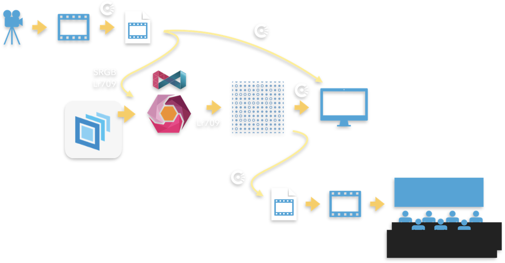
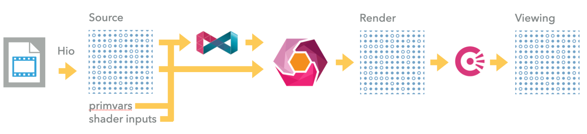
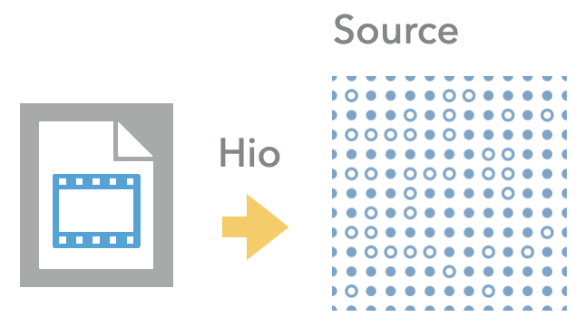
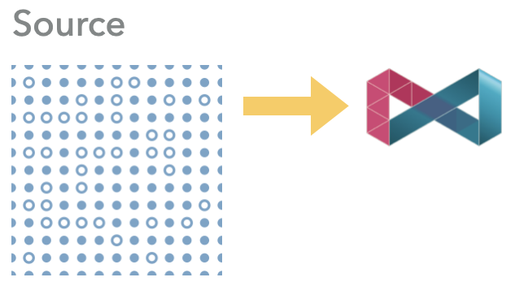
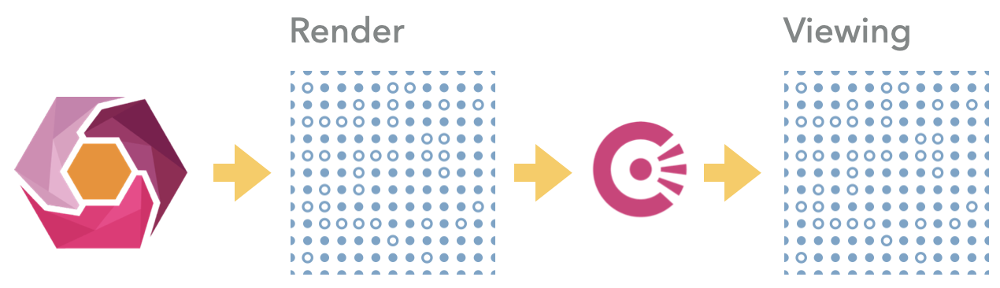

# Color and Universal Scene Description

In the realm of digital imaging and visual effects, the management and transformation of color are paramount. Universal Scene Description (USD) offers a versatile framework for defining and manipulating complex scenes, yet its current capabilities for color management are limited. This article explores the flow of color information through the production pipeline, from initial capture to final presentation, and proposes enhancements to USD for robust and creative color management. By addressing both technical and aesthetic transformations, we aim to enrich the artistic possibilities and technical precision within the USD environment.

**The Complexity of Color Science**

Color science, often perceived as intricate and impenetrable, underpins our very perception of the world. Vision is rooted in the energetic interactions between environmental light sources and the molecules within the retina's photoreceptors. The rods and cones in our retina are resonant structures, quickly attuning to specific wavelengths of energy. However, color vision varies among individuals due to differences in photoreceptor distribution, health, age, and sun damage to the cornea.

Our perception of reality resembles a photograph or film or rendering only fleetingly. While the eye facilitates an energetic exchange between the environment and the brain, a camera induces chemical changes on film or electrical exchanges on sensors to capture an image. These constructed images cannot replicate the eye's dynamic response to the environment and viewer; they merely mediate secondary exchanges between energy sources, paper or screens, and the eye.

The vibrant interplay of spectra, energy, and the nervous system is lost in these images, reduced to the limited responses of silver halide or semiconductor photo-electric charges. Observing a scene, patterns of activation spread through the retina's layers, where they are categorized, organized, and filtered. This refined signal, describing energetic interactions, travels through the optic nerve to the thalamus and ultimately to the occipital lobe, where attention stitches the information into a coherent visual model.

Artists — whether painters, directors, animators, or magicians — understand the importance of attention. They guide viewers through the doors of perception, evoking visual and emotional responses. A photograph can achieve this effect, not due to intrinsic photorealism, but because of our perception and the intricate, beautiful connections we create through art.

To translate the artist's vision into a digital format, the technical side of color management must come into play. The journey of color information through a production pipeline involves numerous stages, each necessitating precise handling of data. This transition from artistic intent to technical execution requires careful management of color transformations. These transformations, whether technical or creative, ensure that the final presentation aligns with the original artistic vision while conforming to the technical requirements of each production stage.



This simplified diagram illustrates how color information flows through a USD based  production pipeline from image to final presentation. At every stage where a color goes from one pipeline step to the next, transformations may occur. These transformations can be technical, conforming data to the input requirements of the step, or creative, modifying the color information to achieve a desired aesthetic result. Such color transformations are important creative tools by which artists guide attention, develop look and tone, and implement various conventions of cinematic vernacular.


Values are captured by cameras then transferred to storage media. The ASC CDL (American Society of Cinematographers Color Decision List) is a format for the exchange of basic primary color grading information between equipment and software from different manufacturers. This information is not captured in our proposed process, but we must recognize the role of complementary data in our analysis.


 
OpenColorIO is then used to prepare the image for the rendering pipeline by transforming the captured data into a source color space recognized by the pipeline. This step is sometimes called an initial grade, or a color conform. Other image sources may include the output of other renders, and those image sources may or may not also involve a grading step.



This is the portion of the pipeline that concerns us within USD itself. The source images, previously conformed in the earlier pipeline step, are read by Hydra’s Hio module. Those source images, and other source values originating in the scenegraph from primvars and shader inputs, are supplied to MaterialX and Hydra, for transformation into rendered values. Those rendered values may be further transformed via mechanisms such as OpenColorIO to final viewing values.



Today, images referenced via USD’s built in UsdUVTexture image reading node must be either SRGB encoded if 8 bit, or, encoded with a linear Rec709 color space otherwise. There may be existing use cases for linear 8 bit encodings; it may be necessary to revisit this assumption should any come to light. These images are supplied to Hydra as is; and renderers such as Storm mandate a rendering color space of Rec709 when producing graphics to store in the framebuffer. The flag to indicate the sRGB encoded 8 bit textures is an important detail to communicate to Storm so texture samplers can be set up properly.



MaterialX can take images in a set of well documented color spaces, but conforms those images to linear Rec709 as part of the work done in generated shader code. Due to historically poor tooling around color transformation concerns (some image processing tools did not record correct colorimetry in image files), MaterialX disregards colorimetry information in source files, requiring the author of a shade graph to annotate inputs in the graph with correct information overriding the information in the source image files.



Hydra produces pixels in the render color space, and optionally performs a color correction task after framebuffer pixels have been generated. This step is a viewing color space conform, governed by an OpenColorIO conf file discovered from the user environment. In DCCs or viewers such as usdview the viewing color transform is often set via options in the user interface, and subsequently communicated to Hydra.


Finally, the values in the viewing space make their way either to a display for immediate viewing, or progress further through the creative pipeline for ultimate presentation to an audience. These steps do not involve USD and are therefore not elaborated here further.


## Definition: Color Space

In the preceding description, there is not one, but three categories of color spaces. The term color spaces as used here is defined as a tuple consisting of red, green, and blue primaries represented as chromaticity coordinates on the CIEXYZ 1931 chromaticity chart, a white point specified within those coordinates, and an encoding transform, which may include a linear segment, a gamma curve, or a combination of both, as well as other potential tone mapping functions.


## Definition: Source Color Space

The source color space refers to the color space associated with the original data. Different attributes and assets may have distinct color spaces. For instance, an OpenEXR image might be encoded in ACEScg, vertex colors could be specified in sRGB, and the color of a light might be defined in linear Rec2020. This diversity allows for precise color handling based on the specific requirements of each element in the production pipeline.


## Definition: Rendering Color Space

The rendering color space is where color values are used for calculations and stored in the frame buffer. This color space is optimized for rendering processes, ensuring that the colors are accurately represented and manipulated during the creation of digital images. It serves as the working space for all color computations, providing a consistent foundation for rendering operations.


## Definition: Viewing Color Space

The viewing color space is the final stage in the color management process. It is the color space defined in the OpenColorIO configuration file and may be specified via environment variables or directly by an application. After the pixels have been processed and finalized in the rendering color space, the viewing transform prepares the final color image for display, ensuring that the colors are accurately represented on the output device according to the specified viewing conditions.


## Introducing Nanocolor

The Nanocolor initiative was made possible through the collaboration and expertise of scientists from Pixar, MaterialX, OpenColorIO, OpenEXR, OpenUSD, and OpenImageIO. These libraries, along with many other rendering systems, include various color processing functions to prepare color values for rendering. Nanocolor, founded under the OpenColorIO umbrella, aims to create a single, lightweight implementation that all libraries can share, ensuring uniform, high-performance color processing. The Nanocolor working group aims to have draft documents and a working prototype available by Siggraph 2024. Currently work is underway at the OpenColorIO Slack instance.

A unique aspect of Nanocolor is its support for invertible color spaces. This means that any color value can have its input transform removed to convert it to a linear color value. These linear values can then be transformed through matrix multiplication and subsequently re-encoded for output. This invertibility allows Nanocolor to seamlessly transform any supported color space to any other, facilitating applications in differentiable rendering and machine learning, thus opening new avenues for research and application in color science.

Nanocolor will provide a minimal set of reserved color space encodings that are universally available and defined by a small number of high-performance operations. These operations can be directly implemented in color processing software, including shaders, ensuring efficient and consistent color management across different platforms and applications.

The initial set is as follows, and matches those found in MaterialX today ( [https://github.com/AcademySoftwareFoundation/MaterialX/blob/main/documents/Specification/MaterialX.Specification.md#color-spaces-and-color-management-systems](https://github.com/AcademySoftwareFoundation/MaterialX/blob/main/documents/Specification/MaterialX.Specification.md#color-spaces-and-color-management-systems)). Be aware that the Color Interop Forum, a sister organization to Nanocolor, is currently working to define and refine a base set that may extend this list, or offer new canonical names for color spaces in this list. Additionally, some may be deprecated, but Nanocolor will retain these for historical reasons. \


* **acescg**: The Academy Color Encoding System, a color space designed for cinematic content creation and exchange, using AP1 primaries
* **adobergb**: A color space developed by Adobe Systems. It has a wider gamut than sRGB and is suitable for photography and printing
* **g18_ap1**: A color space with a 1.8 gamma and an AP1 primaries color gamut
* **g18_rec709**: A color space with a 1.8 gamma, and primaries per the Rec. 709 standard, commonly used in television
* **g22_ap1**: A color space with a 2.2 gamma and an AP1 primaries color gamut
* **g22_rec709**: A color space with a 2.2 gamma, and primaries per the Rec. 709 standard
* **Identity**: Indicates that no transform is applied.
* **lin_adobergb**: The AdobeRGB gamut, and linear gamma
* **lin_ap0**: AP0 primaries, and linear gamma
* **lin_ap1**: AP1 primaries, and linear gamma; these are the ACESCg primaries
* **lin_displayp3**: DisplayP3 gamut, and linear gamma
* **lin_rec709**: A linearized version of the Rec. 709 color space
* **lin_rec2020**: Rec2020 gamut, and linear gamma
* **lin_srgb**: sRGB gamut, linear gamma
* **raw**: Indicates that no transform is applied
* **srgb_displayp3**: sRGB encoding with Display P3 primaries
* **sRGB**: The sRGB color space, intended for viewing (may have a “look” applied)
* **Srgb_texture**: The sRGB color space, intended for rendering

In this proposal, color spaces will be defined using Nanocolor standard transformations. The rendering color space will be a Nanocolor named color space. The viewing color space can be provided by a renderer or specified via an OpenColorIO configuration file. Standard color spaces may also be provided through OpenColorIO configuration files, but these must match the canonical files.


## Source color spaces

Source color spaces will be indicated on attributes using an applied schema called `SourceColorSpaceAPI`. The color space metadata on a color or asset type attribute will specify the color space regardless of any typed schema. Applying `SourceColorSpaceAPI` allows us to declare a color space that will apply to all relevant attributes of a prim and its descendants. This will hold unless another `SourceColorSpaceAPI` schema is applied closer to the property or if the property itself has colorSpace metadata.


#### Default behaviors

If a source color space is not explicitly specified, and none of the prim’s ancestors provide a source color space, the fallback will be either sRGB encoded Rec709 or linear Rec709, depending on the file format. This ensures compatibility with existing data where the color space is not defined.

Many systems, like MaterialX, explicitly specify color space information on inputs. This information will be considered the authored color space for that input and is naturally accommodated when MaterialX graphs are converted to `USDShadeGraph` nodes. However, if this information is not explicitly provided, the default color space for `UsdUvTexture` will be set to "auto." In such cases, the source asset will be checked for color space information. If unavailable, the fallback rules will apply.

If a color space is set on `UsdUvTexture`:inputs to any value other than "auto," that value is considered authoritative and will not be overridden by inherited scene graph properties. This property is treated as a concrete, most local opinion, overriding other settings.


#### Undefined behaviors

Note that the same texture may be referenced in multiple places within the scene graph, each with potentially different `sourceColorSpace` declarations. Such occurrences likely indicate an error in the use of the texture, and should be reported as either an error or a warning. While validating the absence of contradictory color space information is a potential future improvement, it is recommended that texture managers associated with renderers adopt a strategy to avoid undefined behavior. This may include incorporating color space information into cache lookup keys to ensure consistency across accesses.


#### Performance Implications

The primary performance impact color space management imposes on the rendering pipeline is at the point of source color space to rendering color space conversion. Source color spaces may be designated on primvars and shader inputs; they may also be specified on `UsdUvTexture`. Transformations of bulk properties, particularly primvars and texture images can be time consuming, so it will be necessary to implement caching strategies to avoid performing these transformations many times.


## Rendering color space

There can be only one rendering color space active per render destination. The rendering color space may be overridden programmatically by indicating one of the canonical linear Nanocolor spaces to Hydra. If a rendering color space has not been explicitly provided at run time, the fallback is `raw` (or it’s synonym `identity`), which is to say no transform is applied to values to be written. In the `raw` case, if a renderer has a particular default rendering color space such as Rec2020, the renderer may apply a Hydra op to override it, or provide a weak opinion.

The rendering color space is supplied to Hydra from UsdRenderSettings via HdRenderSettings. If no rendering color space is supplied, it will default to raw, which means no color transformation will occur. Identity is the nanocolor standard term for raw which nanocolor supports as a synonym. An example ~

```
def Scope "Render"
{
    def RenderSettings "PrimarySettings" {
        rel products = </Render/PrimaryProduct>
        int2 resolution = (512, 512)
        uniform token renderingColorSpace = "lin_rec2020"
    }

    def RenderSettings "PrimarySettingsRaw" {
        rel products = </Render/PrimaryProduct>
        int2 resolution = (1024, 1024)
        uniform token renderingColorSpace = "raw"
    }

    def RenderProduct "PrimaryProduct" {
        rel camera = </World/main_cam>
        token productName = "/scratch/tmp/render000009.exr"
    }
}
```

#### Performance Implications

The final color transformation before committing values to the frame buffer is the transformation of values output from final nodes such as a BSDF node to the color space of the framebuffer. That transform will be applied as a single 3x3 matrix transform, and as such is not expected to measurably impact performance.


## Viewing color space

As is already the case, the viewing color space may be specified by an OpenColorIO conf file, and applied to the framebuffer after rendering to the rendering color space, by `HdxColorCorrectionTask`. Note that the viewing color space may alternatively be supplied to the color correction task by other means specific to an application.


#### Performance Implications

The viewing color space transformation which does a final conversion on frame buffer values to output frame buffer values in a single pass over the whole image, may be performed by OpenColorIO. The performance of this pass is dependent on the nature of the viewing transform specified for the viewer’s environment.


## OpenUSD implementation details


## Gf

`GfColor3f` and `GfColor4f` will be added to Gf, alongside `GfColorSpace`, which will serve as a convenient interface for Nanocolor within the Gf framework. Nanocolor itself will not be directly exposed beyond Gf. Attributes and properties will continue to be specified as `GfVec3f` or `GfVec4f` when dealing with color in the scene graph representation. The `GfColor` type will be utilized for computational purposes rather than directly representing color in the scene graph. Additionally, batch conversion utilities will be available to facilitate seamless transitions between different color representations.


## Hgi

Hgi will gain utility functions to convert buffers of colors and textures from one space to another; HgiDrivers may implement these conversions on the GPU.


## UsdLux

In UsdLux, if a light's color is specified using an RGB tuple, that tuple may be associated with a specific color space. If no color space is provided, the rules follow those applicable to any other prim.


## MaterialX

MaterialX currently supports the standard color spaces mentioned earlier, and in its code generation process, it embeds code fragments for converting source color spaces to linear Rec709. The MaterialX project plans to transition to Nanocolor, after which it will generate conversion code targeting a specified rendering color space. Until this transition is complete, additional code will need to be integrated into MaterialX-generated code to further adjust output colors to match the rendering color space. There may also be a need to limit rendering to linear Rec709 working spaces if using a MaterialX library predating Nanocolor, with version 1.39 currently expected to introduce these changes.


## Storm

Storm will provide scene indices for color transform that will transform primvars and shader inputs, and any Storm render will be color correct if the rendering color space is selected from the canonical Nanocolor set.

In order to support this functionality for all renderers capable of color correct rendering, we will need:

* a utility in pxr/imaging that can color convert a VtValue.
* A scene index in hdsi that automatically converts primvar values as required for the renderer
* A utility in pxr/imaging to color convert texture buffers to a Nanocolor space for input to shading.


## Summary

In this proposal, the integration of Nanocolor within OpenColorIO, USD, MaterialX, and Storm represents a significant advancement in color management for digital imaging and rendering. We introduce standardized transformations and an ergonomic interface through `GfColor3f`, `GfColor4f`, and `GfColorSpace` within the Gf library.

For MaterialX, the transition to Nanocolor will allow generation of conversion code tailored to specific rendering color spaces. Until this transition is fully realized, bridging code within Hydra may be necessary to transform output colors to the desired rendering color spaces.

Storm's provision of scene indices for color transforms will ensure that primvars and shader inputs undergo appropriate color transformations, supporting color-correct rendering across all Storm-enabled outputs. To fully enable this functionality universally, utilities will be developed within pxr/imaging to handle color conversion tasks efficiently, including converting VtValue instances, automating primvar conversions through hdSi scene indices, and processing texture buffers to Nanocolor standards.

In conclusion, this proposal represents a concerted effort to standardize and optimize color management practices across diverse digital rendering libraries and systems. We aim to enhance precision, consistency, and efficiency in color handling throughout the production pipeline, thereby advancing the quality and fidelity of rendered outputs wherever this system is used.
